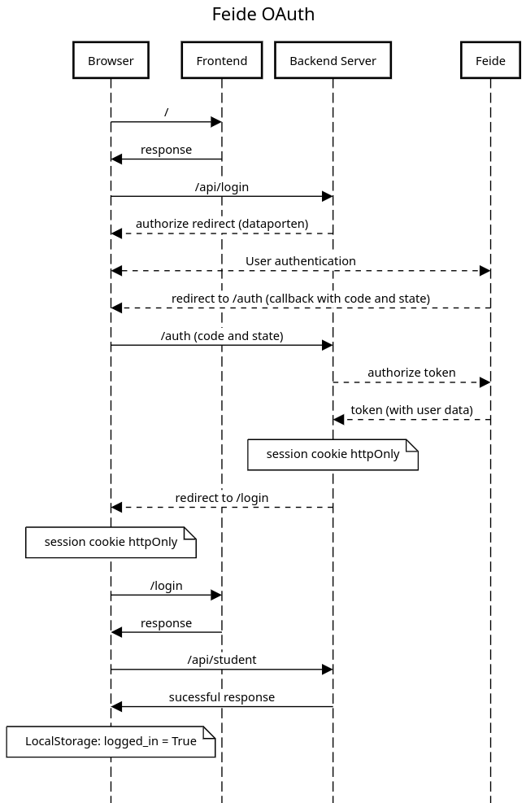
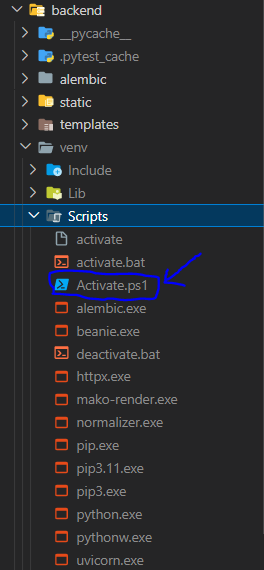
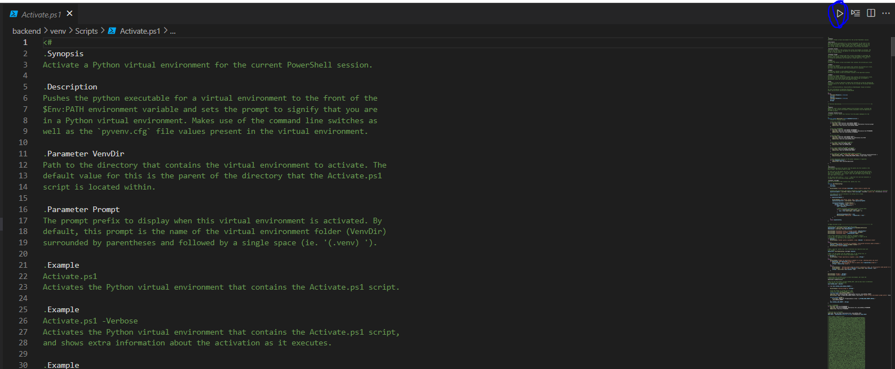
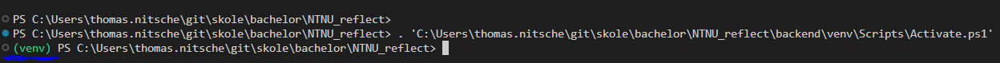

# NTNU Reflect Application

This app is split into 2 main parts:

1. Frontend ([Sveltekit](https://kit.svelte.dev/docs/introduction))
2. Backend in Python ([FastAPI](https://fastapi.tiangolo.com/) + [SqlAlchemy](https://docs.sqlalchemy.org) + [Postgres](https://www.postgresql.org/docs/))


## Feide:

Feide with Oauth is used to authorize users. It can be a bit tricky understand the flow, but here is a diagram trying to show how the authorization is done:



## Frontend
Frontend is developed using sveltekit. The application uses client-side for fetching and requesting data. 
The project uses some installed frameworks to make life easier. 

#### [Tailwind CSS](https://tailwindcss.com/)
The CSS library used for styling the pages and components. Tailwind is easy to pick up and learn, and comes with great documentation. Tailwind is also fully integreated with the components library used in the procject, Svelte Flowbite, meaning you can easily style the finished components how you like. 


#### [Flowbite Svelte](https://flowbite-svelte.com/)
Flowbite svelte is a components library that offers styled components. The components are easy to modify, and comes with alot of functionality. This saves the project from containing alot of boilerplate code and self-made components. The navbar used in the application is an example of this. 


#### [Felte](https://v0.felte.dev/docs)

Felte is a framework for handling forms in Svelte. Error handling in forms, aswell as handling form submission is done using Felte in the project. All the form-handling is done client side.

## Backend
The backend is split into 3 main parts.
This consist of FastAPI, SqlAlchemy and Postgres. [FastAPI](https://fastapi.tiangolo.com/) is a framework for creating APIs in python. [SqlAlchemy](https://docs.sqlalchemy.org) is an ORM (Object Relational Mapper) that makes it easy to work with databases in python. [Postgres](https://www.postgresql.org/docs/) is the database used in production. In development, sqlite is used.

## Enrollment

Students can enroll in a course at the endpoint: `/app/enroll/<semester>/<course id>` or by invitation in the application.
Teaching assistants can only be enrolled via invitation.


# Setup & running

### Development

##### Requirements:
- Python (v3.10)
- [Node + npm](https://docs.npmjs.com/downloading-and-installing-node-js-and-npm)
- [Sqlite](https://www.sqlite.org/download.html) 

##### Environment:

`.env` is not commited to this repo because of security, so this file has to be created.


**Both frontend and backend folders includes a `.env.template` file. This file contains the variables that has to be set in the new `.env` file.**

In the **`backend`** folder, create`.env`file containing the following:
- `production = false`
- `SECRET_KEY` is set
- `client_id` is set
- `client_secret` is set

**The client secrets corresponds to your feide instance!**

In **`frontend`** folder:
- create `.env.development` with PUBLIC_API_URL="http://127.0.0.1:8000".

*See .env.template for what to include in the .env file!*

#### Running Backend :

##### Alternative 1:
```bash
docker-compose up backend
```

#### Alternative 2:
```bash
cd backend

# Creates virtual environment
python -m venv venv # only do once

# Activates virtual environment
source ./venv/bin/activate #Troubleshooting for windows below

# Installing python packages 
pip install -r requirements.txt

# Apply migration scripts
alembic upgrade head

# Run the backend
uvicorn main:app --reload

# Running at 127.0.0.1:8000
```

**Migration**: alembic is used for databse migration (kind of git for databases).
You can read more about alembic [here](https://alembic.sqlalchemy.org/en/latest/tutorial.html), or take a look at this tutorial [video](https://www.youtube.com/watch?v=SdcH6IEi6nE&list=WL&index=6).

When ANY changes is made to the database model file, then a migration has to happen. This is done by the following commands:

```bash
# Create migration
alembic revision --autogenerate -m "Revision message, something relevant here"

# Apply latest migration
alembic upgrade head
```

#### Running Frontend:

Running frontend:
```bash
cd frontend
npm install
npm run dev -- --host 127.0.0.1 #Remember the host IP. Important for feide login

# Running at 127.0.0.1:5173
```

**NB:**

When using feide login locally, it will redirect to localhost/auth. Then you have to manually change the url to 127.0.0.1:8000/auth for it to complete properly. (this could be fixed by updating our feide oauth redirect url, but can only be done by feide...)

#### Troubleshooting
The command 
```bash
source ./venv/bin/activate
```
Is intended for Linux and does not always work on windows. 
Therefore, windows users using VS code, could install the extension `Powershell` (Picture below), to run the activate script in the `venv`-folder. Then manually run the script by clicking the script and clicking `run`.

1. First install the `Powershell` extension


2. Then go into `backend/venv/Scripts/Activate.ps1` and run the script.





3. Click this file and run it. If you see a green `(venv)` in the terminal, then the virtual environment is activates. You can now run the rest of the commands above. 




4. You can now run the rest of the commands to setup and run backend
```bash

# Installing python packages 
pip install -r requirements.txt

# Apply migration scripts
alembic upgrade head

# Run the backend
uvicorn main:app --reload

# Running at 127.0.0.1:8000
```

### Production

In production we have dockerized all the applications and use Postgres as the database. Docker compose is used to setup all the containers together and [traefik](https://doc.traefik.io/) is used as a reverse proxy to the containers and handle ssl.

**Requirements:**
- Docker
- Docker compose

##### Environment:

In the `backend` folder, create`.env` containing the following:
- `production = true`
- `SECRET_KEY` is set
- `client_id` is set
- `client_secret` is set

**the client secrets corresponds to your feide instance**
- the following postgres variables is set: `POSTGRES_USER`, `POSTGRES_PASSWORD`,  `POSTGRES_DB`.
- REDIRECT_URI = "https://ref.iik.ntnu.no/auth"
- BASE_URL = "https://ref.iik.ntnu.no"

In `frontend` folder:
- create `.env.production` with PUBLIC_API_URL="https://refeiik.ntnu.no/api" 

*See .env.template for what to include in the .env file!*

Also make sure that there exists a `certs` folder with the ssl privatekey and certificate (More on this below).

#### Running containers:

```bash
docker-compose build
docker-compose up -d
```

**OBS:**

If you have a firewall on the production server, make sure port 443 is open.

Frontend is running on URL/
Backend api is running on URL/api/
Backend docs is running on URL/api/docs
Backend auth is running on URL/auth

#### Setting up certificates

This section is for how to set up a certificate for a production server. Only use this if theres a need for hosting the application on a new server. 
In order for the server to use HTTPS, a TLS certificate is needed. 
Instructions: 

1. Set up a certificate on [cert manager](https://cert-manager.com/customer/Uninett/idp/ssl/vUMoaUELCX71mTS4x7NC/select).
2. Choose "Feide", not "FEIDE" when logging in. Here you can enroll a new certificate. Click the "enroll certificate" button. On this page you can upload a CSR (Certificate Signing Request) file. 
3. Create a new CSR file using this [tutorial](https://www.ssl.com/how-to/manually-generate-a-certificate-signing-request-csr-using-openssl/). You need [openSSL](https://www.openssl.org/source/) in order to do this.
4. When creating the CSR file, you will be asked to fill in some information. Some of these you dont need to fill in. You should rather not fill in organization details in CSR. The important ones is: 
    1. `country(CO)`. Set this to `"NO"`.
    2. `CN (Common Name)`. Set this to the domain name of the server. In our case `"ref.iik.ntnu.no"`
    3. The rest is filled out automatically using the information stored on NTNU on sectigo. In case the fields are obligatory, it is important that you fill in; `organization(O)`, `organization unit(OU)`, `city(L)`, `state or province(ST)`. 
    `O` is `"Norges Teknisk-Naturvitenskapelige Universitet NTNU"`, `L` is `"Trondheim"`, `ST` is `"Trøndelag"`.
    4. For those who need it, prefix www. is added to the GÉANT OV SSL-certificate type.

5. Remember to save the CSR file someplace you'll find it. Then upload this on cert-manager. 
6. Certificates are controlled consecutively by the administrators. You will recieve a mail when the certificate is approved and ready.
7. When the certificate is approved, you can download the certificate and the private key.
8. The certificate is a `.pem` file, and the private key is a `.key` file. These files should be placed in a `certs` folder in the root of the project.
9. The certificate is now ready to be used by traefik. Change the `traefik.toml` file to use the new certificate.
    This is done by changing the following lines in the `traefik.toml`file:
    ```bash
    tls:
    certificates:
        - certFile: /certs/ref_iik_ntnu_no.pem
        keyFile: /certs/refPRIVATEKEY_nopass.key
    ```
10. The application should now be able to run on the new server.


#### Useful docker commands
    
**List all containers** 


```bash
docker ps
```

**Get logs of a container** 

After running `docker ps` to get the container id, run:


```bash
docker logs `<CONTAINER ID>`
 ```


You dont need to fill in the entire ID, just enough to make it unique.


**Take down all containers** 


```bash
docker-compose down
 ```


# Folder structure
The project is split into 2 main folders, `frontend` and `backend`. The frontend folder contains all the frontend code, and the backend folder contains all the backend code.

#### Root
    .
    ├── backend                 # Backend files
    ├── docs                    # Documentation files (pictures, documentation)
    ├── frontend                # Frontend files
    ├── docker-compose.yml      # docker-compose file. Used for running the project in docker
    ├── traefik.yaml            # Traefik file. Used as reverse proxy

#### backend

**Only listing important files!**

    .
    ├── alembic.ini             # Alembic file. 
    ├── crud.py                 # Crud methods. Functions for performing CRUD operations on database.
    ├── database.py             # Database file. Contains database setup, connection and session.
    ├── Dockerfile              # Dockerfile. Used for building docker image.
    ├── main.py                 # Main file. Contains all the routes for the API.
    ├── model.py                # Database model. Contains all the database models.
    ├── schemas.py              # Schemas. Contains all the schemas used for validating data sent between frontend and backend. 
    ├── requirements.txt        # Requirements file. Contains all the python packages used in the project.

#### Frontend

**Only listing important files!**

    .
    ├── src                     # Src folder. Contains all the source code.
    │   ├── lib                 # Lib folder. Contains utils. 
            ├── components      # Components folder. Contains svelte components.
            ├── stores.ts       # Stores. Contains the svelte stores. 
            ├── validation.ts   # Validation. Contain validation methods used in forms.       
    │   ├── routes              # Routes folder. Contains all the pages in the application.                 
    │   └── types.d.ts          # Typescript types. Contains all the typescript types used in the project.                
    ├── tests                   # Tests folder. Contains all the tests for the project. Playwright is used for testing.
    ├── dockerfile              # Dockerfile. Used for building docker image.
    ├── package-lock.json       # Package lock file. Contains all the node modules used in the project.
    ├── package.json            # Package.json. 
    ├── playwright.config.ts    # Playwright config. Contains all the config for playwright.
    ├── svelte.config.js        # Svelte config. Contains all the config for svelte.
    ├── tailwind.config.cjs     # Tailwind config. Contains all the config for tailwind.
