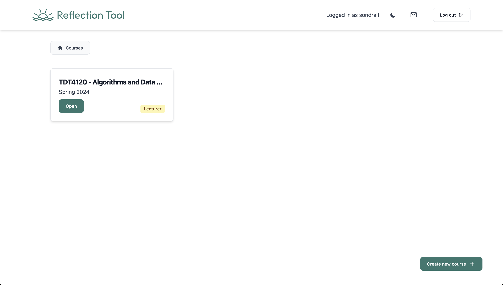

# About the project

Reflection Tool is a website where students can reflect on their learning experience. This is a platform where teachers can create courses and units representing lectures. Students can then enroll in these courses and reflect on the units by submitting their learning experiences. The website is created using Svelte for the frontend, in addition to Python and FastAPI in the backend. The backend uses a Postgres database, and is set up to use SQLite as well.

The Reflection Tool Project is deployed in this [link](https://reflect.iik.ntnu.no/).

The main goal to this project is to create a platform where students can reflect on their learning experiences, and have an AI model summarize and categorize these reflections. The current deployment uses GPT-3.5-turbo from OpenAI as the AI model. (GPT-4 is optional but not currently used since the improvements are not significant).

### Demo video

A demo video of the project can be found [here](https://www.youtube.com/watch?v=Q0LlpVkIMfc).

## How to use the website (Lecturer view)

The website uses Feide, which is a Norwegian authentication system. This means that in order to use the website, you have to be registrered as a student or a teacher in Norway.

After logging in, you will see a `Create new course +`-button if you are registered as a teacher in Feide. By clickin this button, you'll create a new course, and you will now see a new card-component on the home-screen representing this newly created course. Note: If you are enrolled into a course, the card-component will look the same, other than the badge saying `Student` instead of `Lecturer`.



After clickin on a course, you can create new units. Units represents the different lectures of the course. You can create a new unit by clicking the `Create new unit +`-button, and after creating a unit, you will see a new card-component on the course home-screen representing the newly created unit. When on the course home-screen, you can also click on `Invite users` to add students or lecturers to the course. After you've created a unit and the students have submitted some reflections, you can get a view like this:
Note: Here, we can see that the teacher has already generated a previous AI report for this unit, and that a new student has submitted a reflection for this unit since the last time the teacher generated a report.


And when clicking on `View report`, you can get a page like this where you can generate and download the report.


### How to use the website (Student view)

How to use the website as a student is visible [here](./docs/StudentView.md).

# Run the project

This app is split into 2 main parts:

1. Frontend ([Sveltekit](https://kit.svelte.dev/docs/introduction))
2. Backend in Python ([FastAPI](https://fastapi.tiangolo.com/) + [SqlAlchemy](https://docs.sqlalchemy.org) + [Postgres](https://www.postgresql.org/docs/) / [SQLite](https://www.sqlite.org/docs.html))

##### Requirements:

- [Docker](https://docs.docker.com/get-docker/) or [Python](https://www.python.org/downloads/) (v3.9) & [Sqlite](https://www.sqlite.org/download.html)
- [Node + npm](https://docs.npmjs.com/downloading-and-installing-node-js-and-npm)

## Backend

To set up the backend, you have to create a `.env`-file in the `backend`-folder based on the `.env.template`-file. For full documentation on how to set up the backend, see the [backend documentation](./backend/README.md).

After setup of enviroments you can run the following commands:

```bash
make dev
```

or if you are using Windows, you can run the following commands:

```bash
cd backend
docker-compose up --no-deps backend
```

## Frontend

To set up the frontend, you have to create a `.env`-file in the `frontend`-folder based on the `.env.template`-file. For full documentation on how to set up the frontend, see the [frontend documentation](./frontend/README.md).

After setup of enviroments you can run the following commands:

```bash
cd frontend
npm install
npm run dev
```

# Production deployment

For full documentation on how to deploy the project in production, see the [production documentation](./docs/Deployment.md).

# Libraries, frameworks and tech stack

## Frontend

- [Svelte](https://svelte.dev) - A modern frontend compiler that allows you to build high-performance web applications.
- [Vite](https://vitejs.dev) - A build tool that significantly improves the frontend development experience.
- [SvelteKit](https://kit.svelte.dev) - A framework for building server-side rendered applications with Svelte.
- [TypeScript](https://www.typescriptlang.org) - A typed superset of JavaScript that compiles to plain JavaScript, enhancing code quality and maintainability.
- [Tailwind CSS](https://tailwindcss.com) - A utility-first CSS framework for rapidly building custom designs.
- [PostCSS](https://postcss.org) - A tool for transforming CSS with JavaScript, used in this project to process Tailwind CSS.
- [Prettier](https://prettier.io) - An opinionated code formatter that supports many languages, ensuring consistent code style.
- [ESLint](https://eslint.org) - A static code analysis tool for identifying problematic patterns found in JavaScript code.
- [Cypress](https://www.cypress.io) - An end-to-end testing framework for anything that runs in a browser.
- [Vitest](https://vitest.dev) - A Vite-native test runner that is fast and lightweight, used for unit and integration testing.
- [Flowbite](https://flowbite.com) - A free and open-source Tailwind CSS component library that provides a set of components and templates.
- [Felte](https://felte.dev) - A form library for Svelte that is lightweight, fast, and easy to use.

## Backend

- [FastAPI](https://fastapi.tiangolo.com) - A modern, fast (high-performance) web framework for building APIs with Python 3.7+ based on standard Python type hints.
- [Uvicorn](https://www.uvicorn.org) - An ASGI server for Python, built on uvloop and httptools, providing lightning-fast asynchronous capabilities.
- [Pydantic](https://pydantic-docs.helpmanual.io) - A data validation and settings management using Python type annotations.
- [SQLAlchemy](https://www.sqlalchemy.org) - A SQL toolkit and Object-Relational Mapping (ORM) system for Python, providing a full suite of well-known enterprise-level persistence patterns.
- [SQLite](https://www.sqlite.org/index.html) - A C-language library that implements a small, fast, self-contained, high-reliability, full-featured SQL database engine.
- [PostgreSQL](https://www.postgresql.org) - A powerful, open source object-relational database system with over 30 years of active development.
- [Alembic](https://alembic.sqlalchemy.org) - A lightweight database migration tool for use with SQLAlchemy.
- [Jinja2](https://jinja.palletsprojects.com) - A modern and designer-friendly templating language for Python, modeled after Django’s templates.
- [Starlette](https://www.starlette.io) - A lightweight ASGI framework/toolkit, which is ideal for building high performance asyncio services.
- [Authlib](https://authlib.org) - A ready-to-use authentication library for OAuth, OAuth2, OpenID clients, and token servers.
- [OpenAI](https://beta.openai.com/docs) - An API that provides access to the GPT-3.5-turbo model, allowing for advanced natural language processing capabilities.

## Reverse Proxy

- [Traefik](https://doc.traefik.io/traefik) - A modern HTTP reverse proxy and load balancer that makes deploying microservices easy.

## Container

- [Docker](https://www.docker.com) - A platform for developing, shipping, and running applications in containers.

## CI/CD

- [GitLab CI/CD](https://docs.gitlab.com/ee/ci) - A continuous integration and continuous deployment tool built into GitLab that automates the testing and deployment of code changes.

# Run tests

To run tests, you have to set up the backend and frontend as described above. Then you can run the following commands:

### Backend:

```bash
make test-backend
```

Or if you are using Windows, you can run the following described in the Makefile [here](./Makefile):

### Frontend:

```bash
cd frontend
npm run test
```

### End-to-end tests:

To run end-to-end tests, you have to set up a `cypress.env.json`-file in the `frontend`-folder based on the `cypress.env.template.json`-file. The `SESSION_COOKIE` can be found when running the application locally and logging in found in the cookies. (inspect -> application -> cookies -> session).

Make sure that the backend is running.
Then you can run the following commands:

```bash
cd frontend
npx cypress run
```

# Sustainability and Accessibility

If you want to learn about the measures taken to make the project sustainable and accessible, you can read more about it [here](./docs/SustainabilityAccessibility.md).

# Architecture

If you want to learn about the architecture of the project, you can read more about it [here](./docs/Architecture.md).

# Contribution

The project is developed by students at NTNU. If you want to contribute to the project, you can read more about it [here](./docs/Contribution.md).

# Folder structure

The project is split into 2 main folders, `frontend` and `backend`. The frontend-folder contains all the frontend code, and the backend-folder contains all the backend code.

#### Root

    .
    ├── backend                 # Backend files
    ├── docs                    # Documentation files (pictures, documentation)
    ├── frontend                # Frontend files
    ├── docker-compose.yml      # docker-compose file. Used for running the project in docker
    ├── traefik.yaml            # Traefik file. Used as reverse proxy
    └── Makefile                # Makefile. Contains all the commands for running the backend

#### backend

**Only listing important files!**

    .
    ├── alembic.ini             # Alembic file.
    ├── Dockerfile              # Dockerfile. Used for building docker image.
    ├── Dockerfile.test         # Dockerfile for testing.
    ├── requirements.txt        # Requirements file. Contains all the python packages used in the project.
    │   ├── api                 # api folder. Contains main code.
            ├── crud.py                 # Crud methods. Functions for performing CRUD operations on database.
            ├── database.py             # Database file. Contains database setup, connection and session.
            ├── main.py                 # Main file. Contains all the routes for the API.
            ├── model.py                # Database model. Contains all the database models.
            ├── schemas.py              # Schemas. Contains all the schemas used for validating data sent between frontend and backend.
        │   └── utils               # Utils folder. Contains all the utility code.
                └── exceptions.py          # Exceptions, used to handle some exceptions.
    │   ├── prompting           # Prompting folder. Contains all the code for gpt prompting.
            ├── createCategories.py     # Create categories. Contains code for creating categories.
            ├── enforceUniqueCategories.py  # Enforce unique categories. Contains code for enforcing unique categories.
            ├── sort.py                # Sort. Contains code for sorting.
            ├── summary.py             # Summary. Contains code for summarizing.
            └── transformKeysToAnswers.py  # Transform keys to answers. Contains code for transforming keys to answers.
    │   ├── test                # Test folder. Contains all the tests for the project.
            ├── test_main.py            # Test main. Contains tests for the main file.
        │   └── openai                  # OpenAI folder. Contains all the code for openai testing.
                ├── test_createCategories.py           # Test create categories. Contains tests for creating categories.
                ├── test_enforceUniqueCategories.py    # Test enforce unique categories. Contains tests for enforcing unique categories.
                ├── test_sort.py                       # Test sort. Contains tests for sorting.
                ├── test_summary.py                    # Test summary. Contains tests for summary.
                └── test_transformKeysToAnswers.py     # Test transform keys to answers. Contains tests for transforming keys to answers.

#### Frontend

**Only listing important files!**

    .
    ├── src                     # Src folder. Contains all the source code.
    │   ├── lib                 # Lib folder. Contains utils.
            ├── components      # Components folder. Contains svelte components.
            │   └── ...         # Contains all the svelte components.
            ├── stores.ts       # Stores. Contains the svelte stores.
            └── validation.ts   # Validation. Contain validation methods used in forms.
    │   ├── routes              # Routes folder. Contains all the pages in the application.
        │    └── ...             # Contains all the pages in the application.
    │   └── types.d.ts          # Typescript types. Contains all the typescript types used in the project.
    ├── tests                   # Tests folder. Contains all the tests for the project. Playwright is used for testing.
    ├── dockerfile              # Dockerfile. Used for building docker image.
    ├── package-lock.json       # Package lock file. Contains all the node modules used in the project.
    ├── package.json            # Package.json.
    ├── playwright.config.ts    # Playwright config. Contains all the config for playwright.
    ├── svelte.config.js        # Svelte config. Contains all the config for svelte.
    ├── tailwind.config.cjs     # Tailwind config. Contains all the config for tailwind.
    ├── cyperess.config.ts      # Cypress config. Contains all the config for cypress.
    ├── static                  # Static folder. Contains all the static files.
    │   └──  ...                # Contains all the static files.
    ├── test                    # Test folder. Contains all the tests for the project. Cypress is used for testing.
    │   └── ...                 # Contains all the tests for the project.
    ├── cypress                 # Cypress folder. Contains all the cypress tests.
    │   └── ...                 # Contains all the cypress tests.
