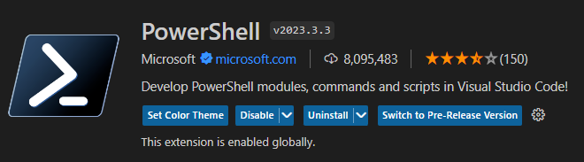

# Backend

## Requirements:

- Docker 
Or
- [Python](https://www.python.org/downloads/) (v3.9) & [Sqlite](https://www.sqlite.org/download.html)

The backend is split into three main parts.
It consists of FastAPI, SqlAlchemy and Postgres. [FastAPI](https://fastapi.tiangolo.com/) is a framework for creating APIs in Python. [SqlAlchemy](https://docs.sqlalchemy.org) is an ORM (Object Relational Mapper) that makes it easy to work with databases in Python. [Postgres](https://www.postgresql.org/docs/) is the database used in production. In development, sqlite is used.

# Setup & running

## Development

### Environment:

`.env` is not commited to this repo because of security, so this file has to be created.

**Both frontend and backend folders includes a `.env.template` file. This file contains the variables that has to be set in the new `.env` file.**

In the **`backend`** folder, create`.env`file containing the following:

- `production = false` (This is used to determine if the database should be sqlite or postgres)
- `SECRET_KEY = random_string` (This is used for hashing)

Feide instance:
- `client_id` is set
- `client_secret` is set
- `REDIRECT_URI` is set
- `BASE_URL` is set

OpenAI authentication:
- `OPENAI_KEY` is set

Note: There are some optional variables in the `.env.template` file. These are not necessary for the application to run, but can be used for testing and development.

### Running Backend :

Note: For linting the backend, the VScode extention `Black Formatter` is used. This is also visible in the [`.gitlab-ci.yml`](../.gitlab-ci.yml)-file where we have a job for checking the linting of the backend.

#### Alternative 1 (docker):
This is the recommended way to run the backend. This will start the backend in a Docker container. To do this, run the following command:

```bash
make dev
```

If you are using Windows, you can run the following commands (every command in the [Makefile](../Makefile)) manually in the terminal:

```bash
docker-compose up --no-deps backend
```

#### Alternative 2 (manual setup):

```bash
cd backend

# Creates virtual environment
python -m venv venv # only do once

# Activates virtual environment
source ./venv/bin/activate #Troubleshooting for windows below

# Installing python packages
pip install -r requirements.txt

# Apply migration scripts
alembic upgrade head

# Run the backend
uvicorn main:app --reload

# Running at 127.0.0.1:8000
```

### Migrations (optinal but not necessary):

**Migration**: alembic is used for databse migration (kind of git for databases).
You can read more about alembic [here](https://alembic.sqlalchemy.org/en/latest/tutorial.html), or take a look at this tutorial [video](https://www.youtube.com/watch?v=SdcH6IEi6nE&list=WL&index=6).

When ANY changes is made to the database model file, then a migration has to happen. This is done by the following commands:

```bash
# Create migration
alembic revision --autogenerate -m "Revision message, something relevant here"

# Apply latest migration
alembic upgrade head
```
### Troubleshooting (for manual setup):

The command

```bash
source ./venv/bin/activate
```

Is intended for Linux and does not always work on windows.
Therefore, windows users using VS code, could install the extension `Powershell` (Picture below), to run the activate script in the `venv`-folder. Then manually run the script by clicking the script and clicking `run`.

1. First install the `Powershell` extension



2. Then go into `backend/venv/Scripts/Activate.ps1` and run the script.


3. Click this file and run it. If you see a green `(venv)` in the terminal, then the virtual environment is activates. You can now run the rest of the commands above.


4. You can now run the rest of the commands to setup and run backend

```bash

# Installing python packages
pip install -r requirements.txt

# Apply migration scripts
alembic upgrade head

# Run the backend
uvicorn main:app --reload

# Running at 127.0.0.1:8000
```

