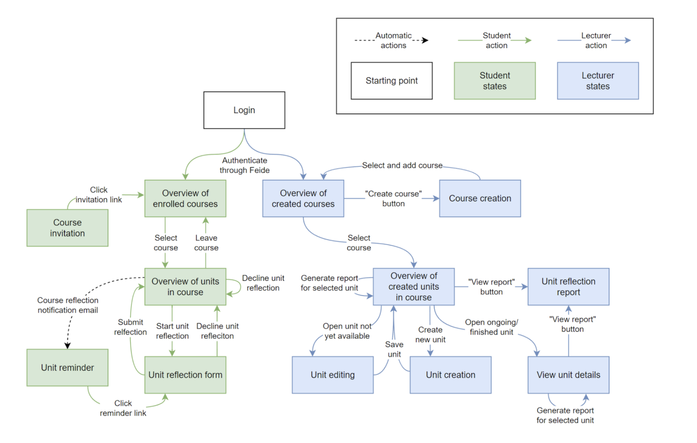
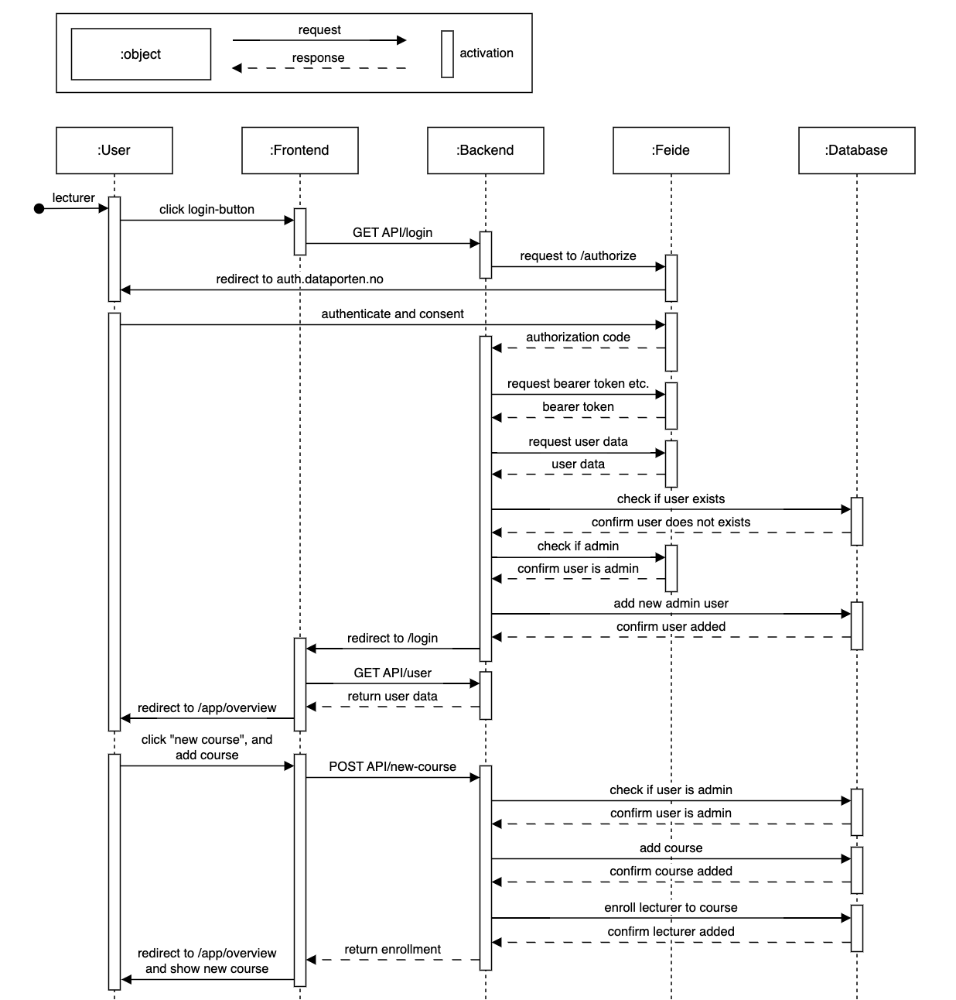
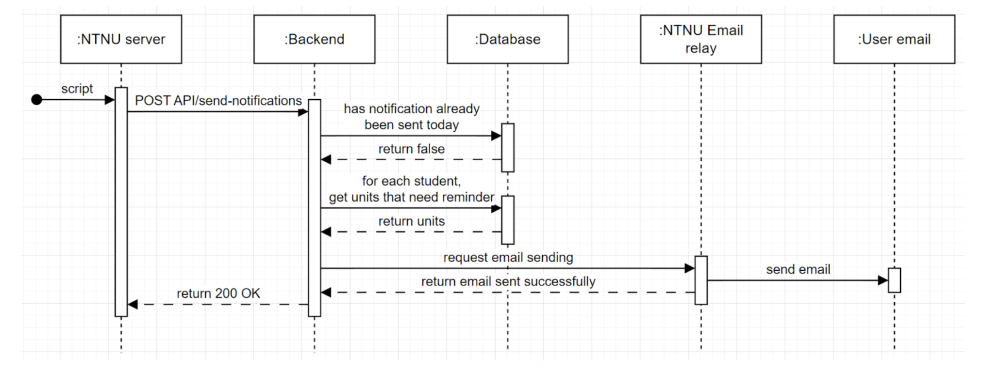
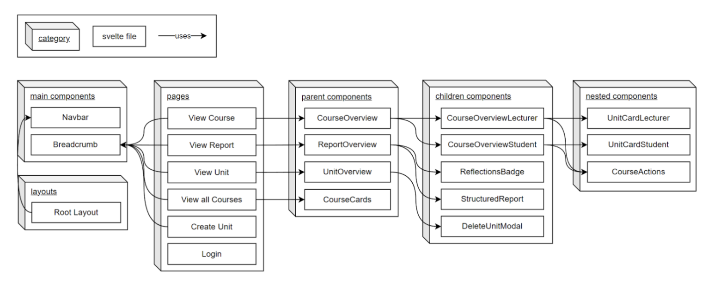
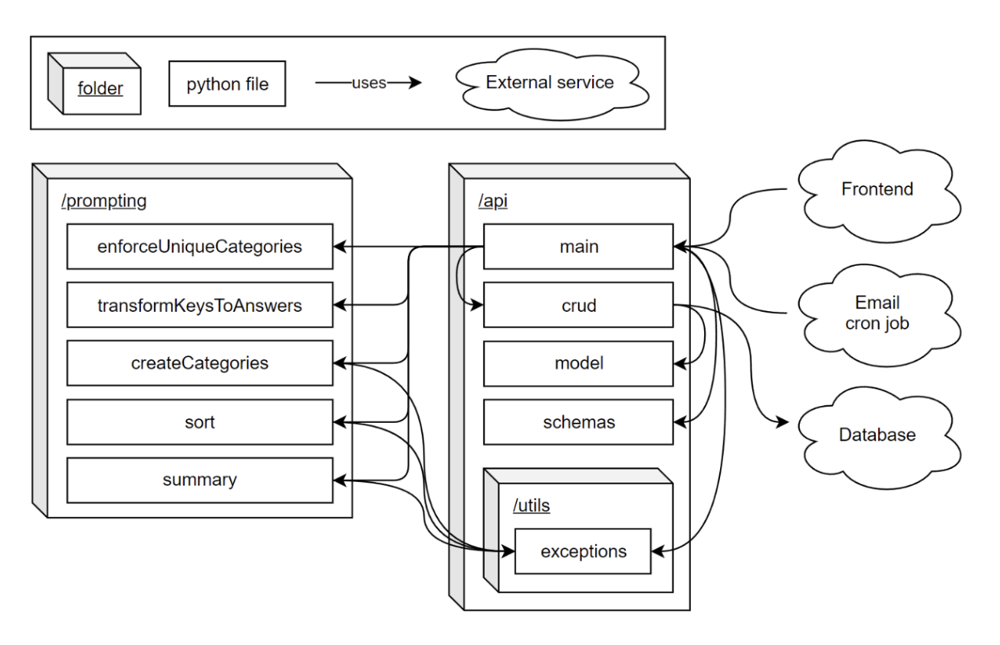
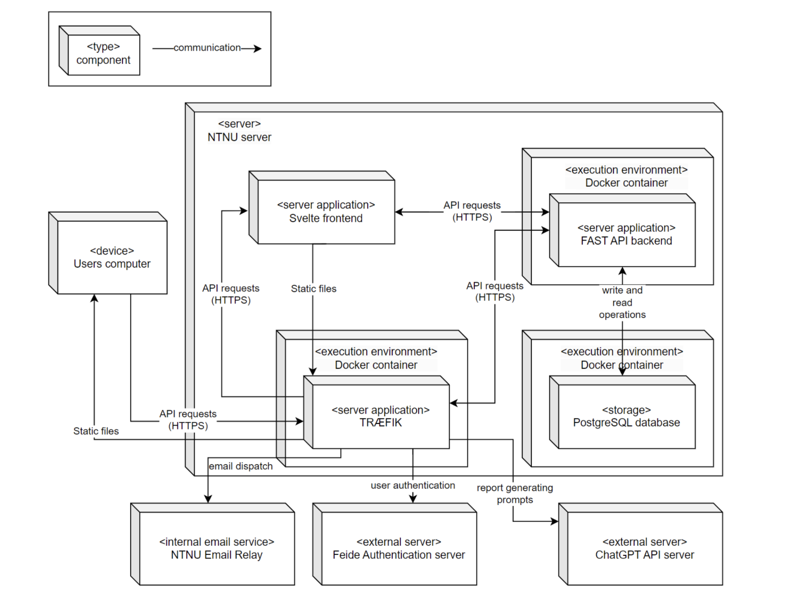
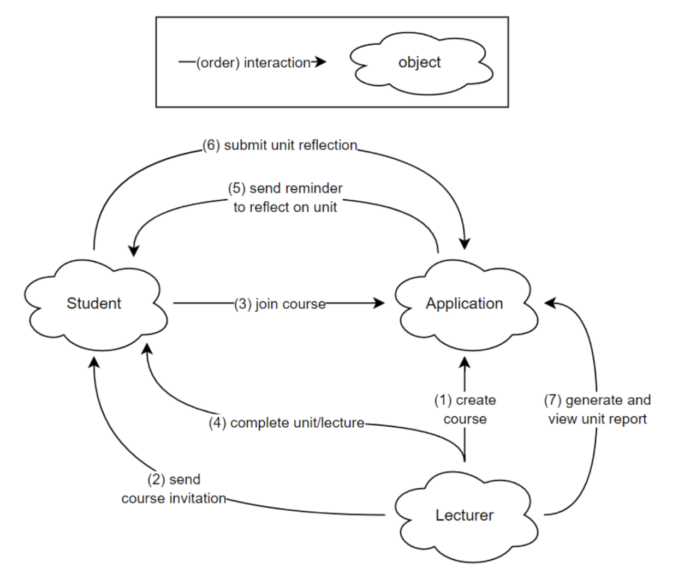

# Application Architecture

## 4+1 Architecture View Model

This document outlines the software architecture of the application using the 4+1 architecture view model, ensuring a comprehensive understanding for all stakeholders.

### Logical View

- **Description**: Decomposes the application's functionality through abstractions relevant to end-users.
- **Diagram**: 

*Figure 1: State diagram showing different states for various end-users.*

### Process View

- **Description**: Shows interaction and operation of application components under specific scenarios.
- **Scenario**: When a lecturer logs in for the first time and creates a course, the application should create a new course and add the lecturer as the course owner.
- **Diagrams**:

*Figure 2: Sequence diagram of a lecturer's authentication and course creation.*

- **Scenario**: When the notification cron job runs, the application should send notifications to all students that has not answered the units of the course.
- **Diagram**:

*Figure 3: Sequence diagram of the notification cron job.*

### Development View

- **Description**: Provides an overview of the application in the development environment from a programmer's perspective.
- **Diagrams**:

*Figure 4: Package diagram of the frontend development view.*

*Figure 5: Package diagram of the backend development view.*

### Physical View

- **Description**: Describes the mapping of application components on hardware.
- **Diagram**: 

*Figure 6: Deployment diagram of the application in production.*

### Scenario View

- **Description**: Demonstrates the architecture through a set of important scenarios.
- **Diagram**: 

*Figure 7: Scenario diagram showing a general use case involving both lecturer and student.*
