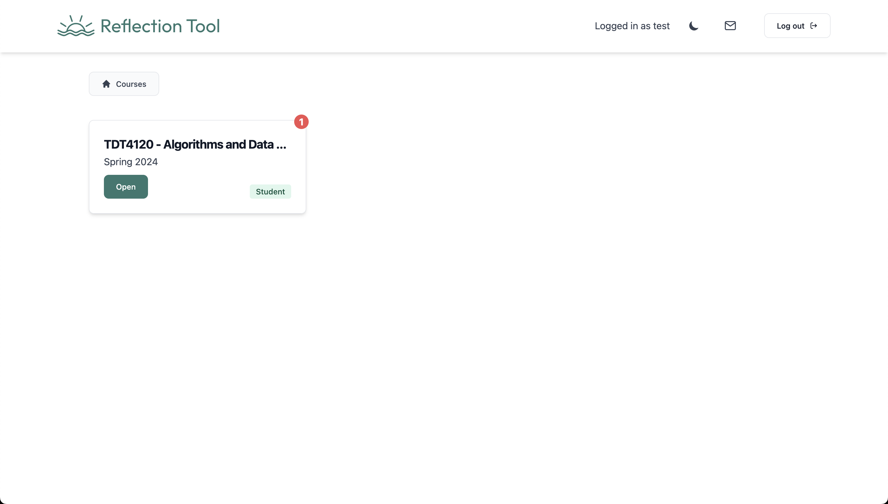
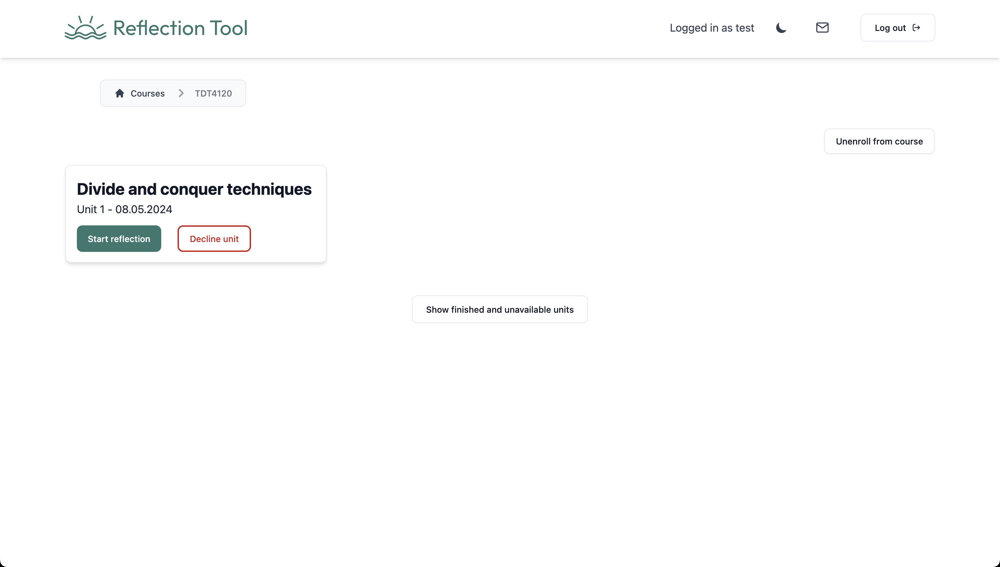
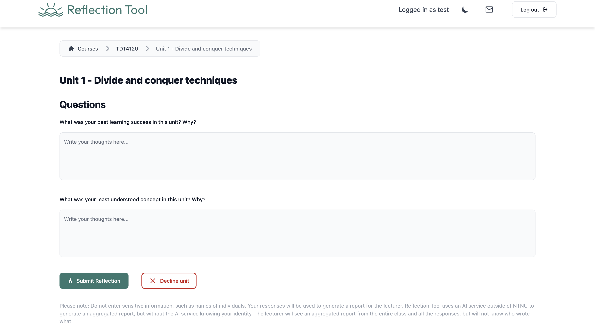

# How to use the website (Student view)

When you first open the website, you will be greeted with the login page. After loging in you will be redirected to the home page and see that its empty since you're not enrolled into any courses. After opening the link the lecturer gives you, you will be automatically enrolled into the course and see this page:

In this example you can see the course and that the student has not responded to a unit yet. If you click on the course you will be redirected to the course page where you can see all the units and the responses you have given. (Units you have already answered, and future units are hidden in a `Show finished and unavailable units` button) You can also see that it is possible to unenroll from the course by clicking the `Unenroll` button.

If you click on `Start reflection`, you will be redirected to the unit page where you can answer the questions. Here, you will see the questions and a text box for writing your answers. Please note that you can also read the information under the `Submit reflection` button to understand how the lecturer will use your answers.

