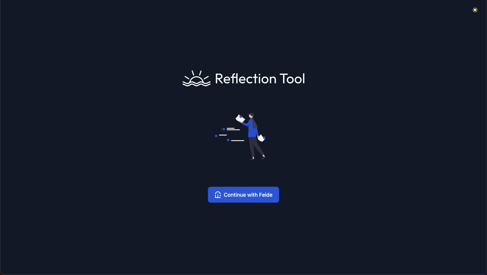
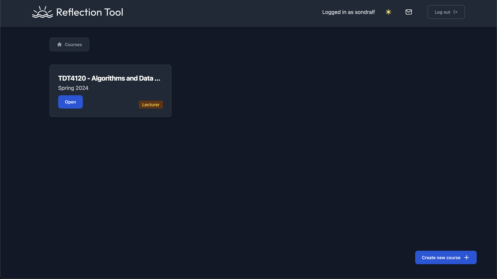
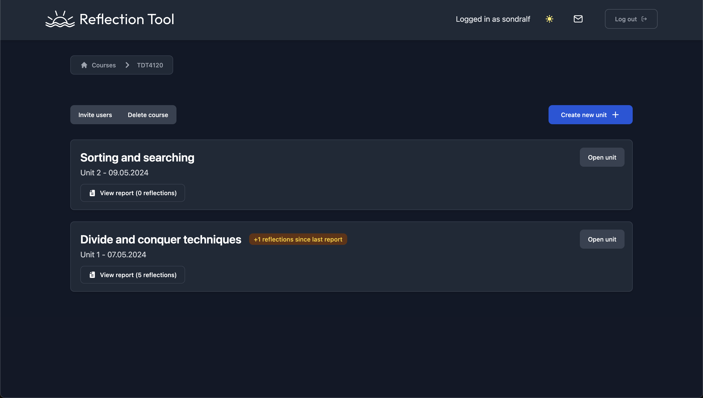
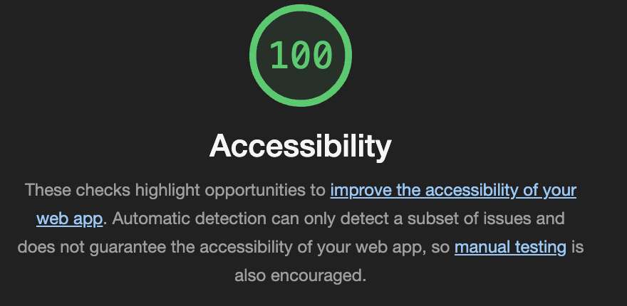
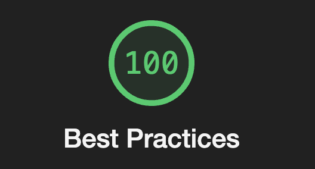
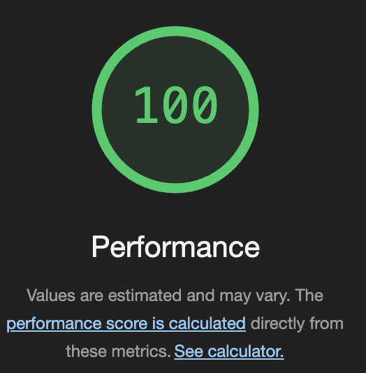
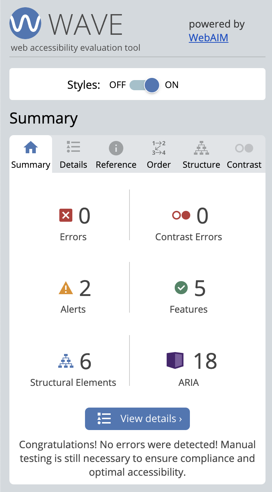
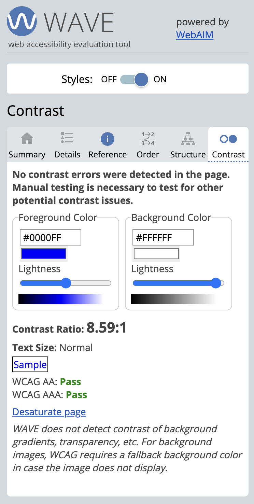

# Sustainability and Accessibility Guidelines

## Dark Mode
Having a dark mode feature in the application is a great way to reduce energy consumption and improve user experience. This will improve the sustainability and accessibility of the application by reducing the amount of light emitted by the screen, and making it easier for users to read the content. This feature has been implmented through a toggle button in the top right corner of the application.

    
    
    

## Sustainability

### Technical Sustainability
- **Open-source Codebase:** Encourages contributions and enhancements from the developer community.
- **Docker Integration:** Ensures consistent development environments to minimize setup discrepancies and streamline onboarding.
- **Flowbite Svelte:** Utilizes a unified design system for consistent UI components, enhancing maintainability.

### Environmental Sustainability
- **Efficient Data Handling:** Focus on optimizing data processing to reduce the energy consumption associated with operating LLMs.
- **Continuous Evaluation:** Regular assessment of the project's environmental impact, particularly the carbon footprint of LLM operations.

## Accessibility

### UI and UX Design Principles
- **Standard Compliance:** Adheres to accessibility standards (WCAG) to ensure the application is usable by people with disabilities.
- **Feide Authentication:** Leverages a familiar authentication system to enhance user experience and accessibility.
- **Keyboard Navigation and Screen Reader Compatibility:** Implements accessible navigation options to accommodate diverse user needs.

## Evaluation Tools

### Google Chrome Lighthouse
The Google Lighthouse tool is used to evaluate the performance, accessibility, best practices, and SEO of the application. It identifies issues such as HTML semantics, contrast issues, and keyboard navigation, enabling the team to address them promptly. Link to the tool: [Google Lighthouse](https://developers.google.com/web/tools/lighthouse)

Using Lighthouse, we found that we got a 100% score in all pages for Accessibility, Best Practices, and Performance. This shows that our application is well-optimized and accessible to all users.

    
    
    

### WAVE Tool
The WAVE tool is used to identify and rectify accessibility issues in real-time during development, ensuring compliance with accessibility standards and enhancing user experience. Link to the extension: [WAVE](https://wave.webaim.org/extension/)

Here we aimed for 0 errors and 0 contrast issues on all pages. We achieved this on all pages and passed all the WCAG AAA standards. This shows that our application is accessible to all users.

    
    

